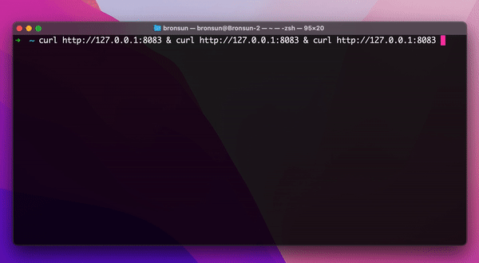

# RequestCounter
Request Counter is a simple solution for counting requests on multipale server instances.

It counts the number of requests to the single server instance and also counts all requests to cluster using Redis as the main key-value database. Docker-compose is used as a conterization solution, but also it simulate 3 instances using Replica method. NGINX is used as main reverse proxy solution.



## Requirements

You need to install following tools:

- Docker with docker-compose: https://docs.docker.com/
- Make:
    
    For Linux Distro:  
    ```
    sudo apt-get install build-essential
    ```

    For Windows: 
    
    1. Install chocolatey https://chocolatey.org/install 
    
    2. Run command
    ```
    choco install make
    ``` 

    For MacOS: 
    ```
    xcode-select --install or brew install make
    ```

## RUN & BUILD

Build project in docker:
```
make build-docker
```

Run project in docker
```
make run-docker
```

Clear docker containers
```
make clean-docker
```

## Tools used

#### NGINX

It is used as reverse proxy for our web server. 

#### REDIS

It is used as key-value store to saving total number of requests from all instances

## Packages

In project was used Redis, as key-value store for saving total numbers of requests on all server instances. For easier development Redis package was used as a solution for connecting to database.

https://github.com/go-redis/redis


